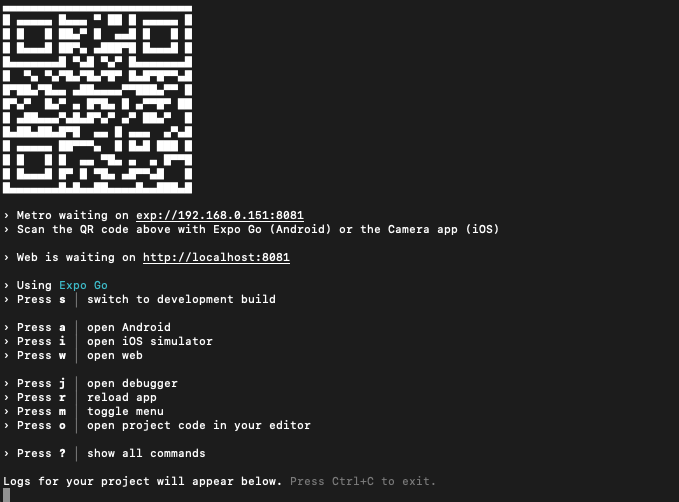

# Crush Debt$ App


_A personal finance application to help you crush your debts!_

## 🚀 How to use

In your terminal run the following:
`prerequisite: node version >18`

**1. Install**
`npm install`

**2. Run**
`npm run start`

**2. Test**
If built successfully, use your phone to scan QR code :

## Tech Stack

1. **React Native**

   - **Purpose**: React Native is used for developing cross-platform mobile applications. It allows us to write code in JavaScript or TypeScript and deploy it natively on Android, iOS, and the web.
   - **Documentation**: [React Native Documentation](https://reactnative.dev/docs/getting-started)

2. **Expo**

   - **Purpose**: Expo simplifies the development process by providing tools and libraries for building React Native apps. It offers features like easy project setup, over-the-air updates, and access to native APIs.
   - **Documentation**: [Expo Documentation](https://docs.expo.dev/)

3. **Firebase/Firestore**

   - **Purpose**: Firebase Firestore is our chosen NoSQL database. It provides real-time synchronization, offline support, and seamless integration with other Firebase services.
   - **Documentation**: [Firebase Firestore Documentation](https://firebase.google.com/docs/firestore/)

4. **Nativewind**

   - **Purpose**: Nativewind is a universal style system for React Native, inspired by Tailwind CSS. It ensures consistent styling across platforms and simplifies responsive design.
   - **Documentation**: [NativeWind Documentation](https://www.nativewind.dev/)

5. **react-hook-form**
   - **Purpose**: This library offers powerful form validation with minimal re-renders. It simplifies form handling and enhances user experience.
   - **Documentation**: [React Hook Form API Documentation](https://react-hook-form.com/docs)

</br>

## Components

### Containers

`.@/components/ui/Containers`
**This file contains UI wrapper components for your application content:**

- `PageContainer`: A Custom Component to wrap a screen. It utilizes the `View` component.
- `SectionContainer.tsx`: A Custom Component to wrap a `section` within a `PageContainer`. It utilizes the `View` component.
- `ContentContainer.tsx`: A Custom Component to wrap the `main content body` witin a `SectionContainer`.It utilizes the `View` component.
- `HeaderContainer.tsx`: A Custom Component to wrap the `header` witin `ContentContainer`. It utilizes the `View` component.

#### How to use

```typescript
// index.tsx
// Add the below in return statement of component
// Wraps the entire Screen...
<PageContainer>
	// Wraps the entire Main content...
	<ContentContainer>
		// Holds title and any subtitle content etc..
		<HeaderContainer>
			// Title here
			<Text> Heading Here </Text>
		</HeaderContainer>
		// Holds a chunk of content within main content container...
		<SectionContainer>
			// Main body content here...
			<Button
				title="Start Now"
				onPress={() => router.replace("/onboarding/welcome")}
			/>
			<Button
				title="TEST REGISTER"
				onPress={() => router.replace("/onboarding/register")}
			/>
		</SectionContainer>
	</ContentContainer>
</PageContainer>
```

</br>

### Auth Forms

`.@/components/forms`
**This file contains UI wrapper components for your application content:**

- `FormAuth`: A Custom Form component to handle `login/signup` using `react-hook-form`.

#### How to use

```typescript
import React from "react";
import { PageContainer } from "@/components/ui/Containers";
import FormAuth from "@/components/forms/FormAuth";
import { FormType } from "@/types/enums";

const register = () => {
	return (
		<PageContainer>
			<FormAuth type={FormType["register"]} />
		</PageContainer>
	);
};

export default register;
```
